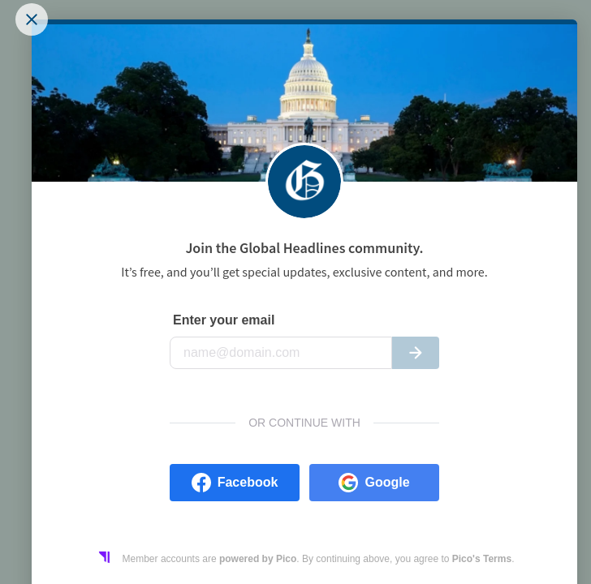
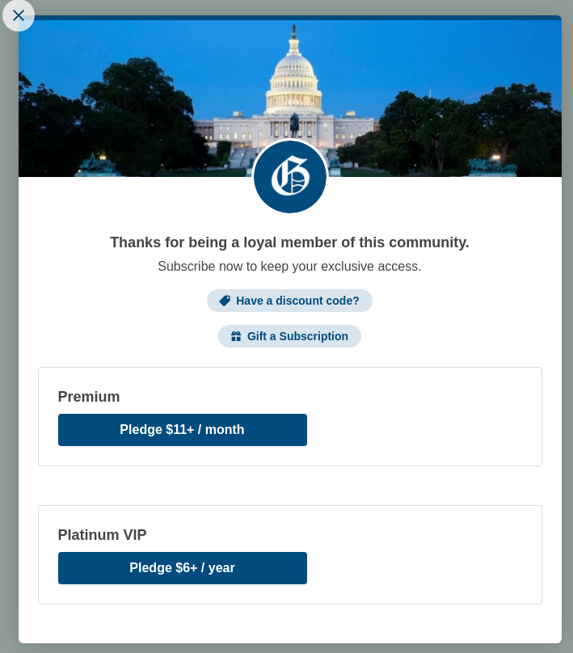

## Quality Support Engineer Take Home Challenge!

Check out [Pico Help](https://help.trypico.com) for advice and support for using Pico. This challenge is designed to familarize you with Pico.

#### Tasks:
1 Get the sample test site running locally on your computer.
  
Add `wrapper.local` as a local host to your `/etc/hosts` aliasing to localhost and 127.0.0.1
Run the local site container running using `docker-compose`. You may need to install Docker Desktop
Navigate to `http://wrapper.local` in your web broswer and ensure you can view the support site.

2 Load the `Pico Gadget`!    

* Review installation [instructions](https://help.trypico.com/en/articles/3199263-installing-pico-on-your-website) for the manual installation of the Pico Gadget
* Modify `header.php` so it loads the Gadget code from Pico's staging environment: `https://gadget.staging.pico.tools/wrapper.min.js`
* Fix any console errors about the publisher ID not being found by editing `docker-compose.yml` to use publisher `c9298a6f-566d-4507-9def-116384264538`
* When you refresh the site you should see the gadget on the site as it will popup on the screen.
   

3 Use the [Pico Signals feature](https://help.trypico.com/en/articles/2906319-using-pico-signals)
    
* Add a new element to the site with signals that will show when a user has registered.
* This element can be something simple - like a div with 'Welcome back!' inside. If the user is anonymous then it should be hidden.

4 Add [custom triggers]() to the site.

* Add a custom trigger (button) that will open a registration prompt. The registration prompt will look similar to:

* Add a custom trigger (any html element) that will open a payment prompt for a specific plan. The element will need to have
class="PicoPlan_XXX" (where XXX is the short code for the plan). 
* HINT: You can find the short code by inspecting the POST response from 
https://api.staging.pico.tools/loader/guest. The key is short_code and will look like 1a23bcde. It has 8 characters with numbers and letters.
https://help.trypico.com/en/articles/2906365-custom-triggers 
* A payment prompt will look similar to:

### Have fun!
